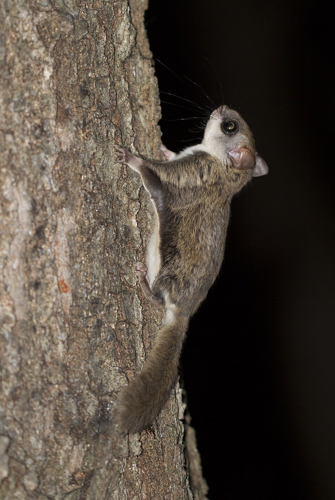

```{r configuracion, include=FALSE}
knitr::opts_chunk$set(echo = TRUE)
```

# 1. Introducción

## 1.1. *Glaucomys*

*Glaucomys* es un género de ardilla voladora dentro de la familia Sciuridae y el orden Rodentia, este género habita en el Nuevo Mundo, concretamente en América del Norte. Estas son capaces de planear entre árboles lo que les permite tener todo el <span style="color: green;">**bosque**</span> explorado. Estos animales aparte de ser arbóreos son estrictamente **nocturnos** [@muul1965behavioral].




Estas dos características hacen que su avistamiento por humanos in situ sea bastante disficultoso para su estudio por lo que se opta por usar cámaras de foto trampeo en estudios.

## 1.2. Datos

<!-- Empezamos cargandos las librerías que vamos a necesitar -->

```{r cargar-librerias, echo=FALSE, warning=FALSE, message=FALSE}
library(tidyverse)
```

<!-- Todos los datos con los que vamos están dentro de la carpeta del propio Rmarkdown. -->

```{r leer datos, echo=FALSE}
data <- read.csv("Data.csv", row.names = NULL)
location <- read.csv("Location.csv", row.names = NULL)
```

<!-- A continuación vamos a usar los datos y mencionar la página web de los datos -->

Las dos bases de datos de este trabajo fueron extraídas de la página web [kaggle](https://www.kaggle.com/datasets/thedevastator/camera-trap-performance-for-nocturnal-mammals). 

<!-- Vamos a visualizar por primera vez los dos conjuntos de datos -->

```{r visualizacion de datos, echo=FALSE}
knitr::kable(head(data, 10), align = 'c', caption = "Tabla 1: Diez primeras filas de la tabla de avistamientos")
knitr::kable(head(location, 10), align = 'c', caption = "Tabla 2: Diez primeras filas de la tabla de las cámaras")
```

Las bases de datos tienen `r ncol(data)` columnas y `r nrow(data)` filas y `r ncol(location)` columnas y `r nrow(location)` filas respectivamente.

## 1.3. Hipótesis

Tenemos varias varías hipótesis, nuestra primera hipótesis es:

### 1.3.1 Primera hipótesis

H0 = El número total de capturas no influye en la cantidad de ardillas voladoras registradas.

H1 = El número total de capturas si influye en la cantidad de ardillas voladoras registradas.

<!-- Hacemos un select para esta poder visualizar nuestra tercera tabla -->

```{r hipotesis 1, echo=FALSE}
h1data <- data %>% 
  select(FlyingSquirrel_captures,
         Total_captures)
```

<!-- Representamos las tabla -->

```{r tabla 3, echo=FALSE}
knitr::kable(head(h1data, 10), align = 'c', caption = "Tabla 3: Diez primeras filas de la hipótesis 1")
```

Para esta hipótesis solo usaremos dos variables: Total_captures y FlyingSquirrels_captures. La primera variable nos indica el número total de animales captados por la cámara de fototrampeo y FlyingSquirrels_captures el número total de ardillas voladores del género *Glaucomys* ese día.

### 1.3.2. Segunda hipótesis

H0 = No existe relación entre el número de capturas de ardillas voladoras y otro mamíferos.

H1 = Existe relación entre el número de capturas de ardillas voladoras y otro mamíferos.

<!-- Hacemos un select para esta poder visualizar nuestra cuarta tabla -->

```{r hipotesis 2,echo=FALSE}
h2data <- data %>% 
  select(FlyingSquirrel_captures,
         Other_Mammal_captures)
```

<!-- Representamos las tabla -->

```{r tabla 4, echo=FALSE}
knitr::kable(head(h2data, 10), align = 'c', caption = "Tabla 4: Diez primeras filas de la hipotesis 2")
```

Para esta hipótesis solo usaremos dos variables: Other_Mammals_Captures y FlyingSquirrels_captures. La primera variable nos indica el número total de mamíferos que no sean ardillas captados por la cámara de fototrampeo y FlyingSquirrels_captures el número total de ardillas voladores del género *Glaucomys* ese día.

### 1.3.3. Tercera hipótesis

H0 = No existe relación entre el número de ardillas detectadas y la localización de la cámara.

H1= Existe relación entre el número de ardillas detectadas y la localización de la cámara.

<!-- Hacemos un select para esta poder visualizar nuestra quinta tabla -->

```{r hipotesis 3,echo=FALSE}
h3data <- data %>% 
  select(Site,
         FlyingSquirrel_captures)
```

<!-- Representamos la tabla -->

```{r tabla 5,echo=FALSE}
knitr::kable(head(h3data, 15), align = 'c', caption = "Tabla 5: Quince primeras filas hipótesis 3")
```

Para esta hipótesis solo usaremos dos variables: Site y FlyingSquirrels_captures. La primera variable nos indica el lugar de la cámara de fototrampeo y FlyingSquirrels_captures el número total de ardillas voladores del género *Glaucomys* en ese lugar.

# 2. Materiales y Métodos

El estudio se baso en un muestreo de fototrampeo en **multiples sitios geograficos**, utilizando camaras trampas para detectar a la ardilla voladora (*Glaucomys volans*). Para ello, hemos empleado R con las librería Tidyverse [@wickham2019tidyverse], para poder llevar a cabo los analisis y la creacion de graficos con los que hemos constrastado las hipotesis.

## 2.1. Primera hipótesis

Para llevar a cabo los analisis estadisticos hemos formulado varias hipotesis, la primera de ellas es la hipotesis nula, que es la siguiente, **H0 = El número total de capturas no influye en la cantidad de ardillas voladoras registradas**, la hipotesis alternativa es, por tanto, la siguiente **H1 = El número total de capturas si influye en la cantidad de ardillas voladoras registradas**.

<!-- Hacemos un t-test para poder averiguar el valor de "p" y ver si las diferencias son significativas -->

```{r ttest h1, echo = FALSE, include = FALSE, warning = FALSE}
ttesth1 <- t.test(h1data$Total_captures, 
                  h1data$FlyingSquirrel_captures, 
                  paired = TRUE)
print(ttesth1)
```

<!-- A continuación para hacer la gráfica hemos utilizado los datos de h1data -->

```{r grafica h1, warning = FALSE, include = FALSE, echo = FALSE, fig.cap = "Fig 1. Influencia de capturas en la cantidad de ardillas detectadas"}
graficoh1 <- ggplot(h1data, aes(x = Total_captures, y = FlyingSquirrel_captures)) +
   geom_point(alpha = 0.6, size = 2) +
  geom_smooth(method = "lm", se = TRUE, color = "green") +
  labs(title = "Relacion entre total de capturas y cantidad de ardillas ", 
       x = "Total de capturas",
       y = "cantidad de ardillas") +
  theme_minimal()
```

Lo primero que hemos comprabado ha sido la p para comprobar si hay relación entre ambas variables.

Y tras comprobarlo hemos realizado un gráfico, que veremos en el apartado de resultados.

## 2.2. Segunda hipótesis

Una vez comprobada la hipotesis anterior, pasamos a formular una nueva hipotesis, siendo esta la hipotesis nula candidata, **H0 = No hay relacion entre la media de captura de otros mamiferos respecto a la media de captura de la ardillas voladora**, por ende, la hipotesis alternativa quedaria de la siguiente forma **H1 = Hay relacion entre la media de captura de otros mamiferos respecto a la media de captura de la ardillas voladora**. 

Para comprobar esta nueva hipotesis, seleccionamos las siguientes variables, como variable **independiente** ha sido seleccionada la columna **Other_Mammal_captures** y como variable **dependiente** ha sido elegida la columna **FlyingSquirrel_captures**.

<!-- Ya hemos creado anteriormente h2data para esta nueva hipótesis.  -->

Una vez extraidas las columnas fue cuando se llevo a cabo el analisis estadistico para poder saber el **p-value** y ver si las diferencias son o no significativas.

```{r ttest h2, echo = FALSE, include = FALSE, warning = FALSE}
ttesth2 <- t.test(h2data$Other_Mammal_captures, 
                  h2data$FlyingSquirrel_captures, 
                  paired = TRUE)
print(ttesth2)
```

## 2.3. Tercera hipótesis

Para la tercera hipótesis que recordamos era:

**H0: No hay diferencias significativas entre las fechas de observación en cuanto al número de ardillas.**

**H1: Hay diferencias significativas entre las fechas de observación en cuanto al número de ardillas**

Usamos un anova para poder ver si hay diferencias significativas entre los sitios usando el valor p como referencia. Tenemos un Nivel de confianza del 95% por lo que nuestra p deberá ser inferior a 0.05.

Tras ver si hay diferencias significativas, en caso afirmativo usaremos una prueba post-hoc concretamente, TukeyHSD.

```{r anova h3, echo=FALSE, include=FALSE}
anovah3 <- aov(FlyingSquirrel_captures ~ Site, data = h3data)
print(anovah3)    
```

```{r print anova h3, echo=FALSE, include=FALSE}
summary(anovah3)
```

```{r tukey h3, echo=FALSE, include=FALSE}
prueba_tukeyh3 <- TukeyHSD(anovah3)
```

# 3. Resultados

## 3.1.Primera hipótesis

H0 = El número total de capturas no influye en la cantidad de ardillas voladoras registradas.
H1 = El número total de capturas si influye en la cantidad de ardillas voladoras registradas.

El análisis estadístico realizado mediante la prueba ANOVA muestra la existencia de diferencias estadísticamente significativas entre el número total de capturas y la cantidad de ardillas voladoras registradas **(p = 0.0006068)**. 

Dado que el valor de *p valor* es inferior a 0.05, se rechaza la hipótesis nula (H₀) y se acepta la **hipótesis alternativa (H₁)**, indicando que el número total de captura y la cantidad de ardillas voladoras registradas están relacionadas.

```{r grafica h1.1, warning = FALSE, include = TRUE, echo = FALSE, fig.cap = "Fig 1. Influencia de capturas en la cantidad de ardillas detectadas"}
print(graficoh1)
```

Por otro lado, se representa esta relación mediante un **gráfico de dispersión**. La gráfica muestra una **tendencia positiva**, de manera que a medida que aumenta el número total de capturas, también se incrementa la cantidad de ardillas voladoras detectadas. 

## 3.2. Segunda hipótesis

H0 = No hay relacion entre la media de captura de otros mamiferos respecto a la media de captura de la ardillas voladoras.
H1 = Hay relacion entre la media de captura de otros mamiferos respecto a la media de captura de la ardillas voladoras.

Los resultados del análisis mostraron que no se encontraron diferencias estadísticamente significativas entre ambas variables **(p = 0.3903)**.

Dado que el valor de *p valor* es superior a 0.05, se acepta la **hipótesis nula**, no hay relación entre estas dos variables.

```{r representacion grafica h2, include = TRUE, warning = FALSE, echo = FALSE, fig.cap = "Fig 2. relacion entre la media de capturas de otros mamiferos respecto a la captura de ardillas"}
ggplot(h2data, aes(x = Other_Mammal_captures, y = FlyingSquirrel_captures, color = Other_Mammal_captures)) +
  geom_point(alpha = 0.6, size = 2) +
  geom_smooth(method = "lm", se = TRUE, color = "blue") +
  labs(tittle = "relacion entre captura de ardillas y otros mamiferos",
       x = "captura de otros mamiferos",
       y = "captura de ardillas voladoras") +
  theme_minimal()
```

En esta gráfica se representa la relación entre ambas variables y muestra una **tendencia ligeramente negativa**. A mayores valores de capturas de otros mamíferos se observa una leve disminución en la cantidad de ardillas voladoras registradas.

## 3.3. Tercera hipótesis

H0: No hay diferencias significativas entre los sitios de muestreos en cuanto al número de ardillas.
H1: Hay diferencias significativas entre los sitios de muestreos en cuanto al número de ardillas.

Los resultados del análisis mostraron diferencias estadísticamente significativas entre los sitios muestreados **(p = 0.0455)**.

El resultado del ANOVA mostró un *p valor* de **p = 0.0455**, el cual es menor que 0.05, por lo tanto, se rechaza la hipótesis nula (H0) y se acepta la hipótesis alternativa (H1), indicando que existen diferencias estadísticamente significativas entre los sitios de muestreos y el numero de ardillas.

```{r grafica h3, warning = FALSE, include = TRUE, echo = FALSE, fig.cap = "Fig 3. Cantidad de Ardillas Detectadas por Lugar"}
graficoh3 <- h3data %>%
  ggplot(aes(x = Site, y = FlyingSquirrel_captures, color = Site)) +
  geom_bar(stat = "identity", fill = "steelblue") +
    labs(
    title = "Frecuencia de Capturas de Ardilla por Lugar",
    x = "Lugar",
    y = "Total de Capturas de Ardillas"
  ) +
    theme(axis.text.x = element_text(angle = 45, hjust = 1))
```

```{r representacion grafica 3, echo=FALSE}
print(graficoh3)
```

Para identificar entre qué sitios se presentan las diferencias, se aplicó la **prueba Tukey HSD**. Los resultados indican que, con un **95 % de confianza**, existe una diferencia significativa en la media de capturas entre los sitios SCHU y CRAN, siendo **SCHU** el sitio con la media más alta de capturas de ardillas voladoras en comparación con CRAN.

# 4. Conclusiones

En conclusión, los resultados obtenidos permiten afirmar que el número total de capturas influye de manera significativa en la cantidad de ardillas voladoras registradas. El valor de p obtenido indica una relación estadísticamente significativa entre ambas variables, lo que conlleva al rechazo de la hipótesis nula y a la aceptación de la hipótesis alternativa.

Basándonos en evidencias estadísticas proporcionada por la prueba t-test, no podemos concluir que exista relación entre la captura promedio de otros mamíferos respecto a la captura promedio de ardilla voladora. Tanto los análisis estadísticos como gráficos nos sugieren que las diferencias observadas en las capturas, si las hay, no son lo suficientemente grandes ni consistentes para aceptar la hipótesis alternativa. Por tanto, mantenemos que la hipótesis aceptada es la hipótesis nula que dictaba que no existía relación entre la media de captura de otros mamíferos respecto a la media de capturas de ardilla voladora.

Como conclusión final podemos ver que sí que hay un diferencia significativa entre los lugares que se registraron las ardillas.

# 5. Bibliografía